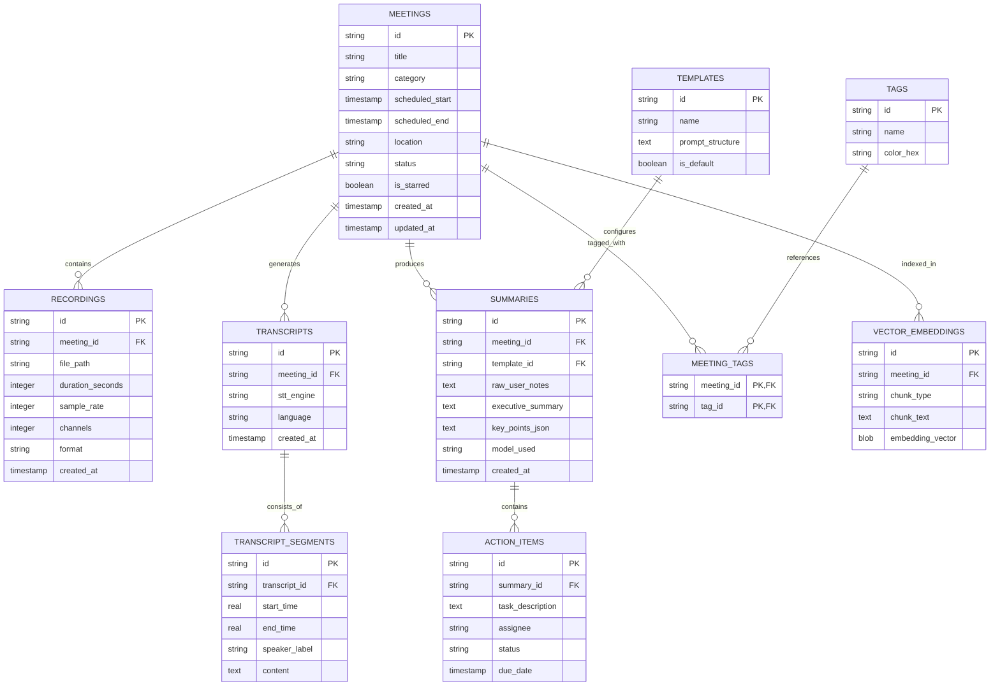

# Database Architecture & Schema Specification: NexaMeet

## 1. Overview & Engine Configuration

NexaMeet uses an embedded local-first database powered by **SQLite 3** via the `rusqlite` crate in Rust.

### Engine Parameters
- **Pragmas**:
  - `PRAGMA journal_mode = WAL;` (Write-Ahead Logging for high concurrent read/write throughput)
  - `PRAGMA synchronous = NORMAL;`
  - `PRAGMA foreign_keys = ON;`
  - `PRAGMA auto_vacuum = INCREMENTAL;`
- **Extensions**:
  - `fts5`: Full-Text Search on transcripts, user notes, and AI summaries.
  - `sqlite-vec`: Local vector storage and similarity search for RAG / semantic querying.

---

## 2. Entity-Relationship Diagram (ERD)



---

## 3. SQL Table Schemas

### 3.1 `meetings`
Stores core metadata for each meeting entry.

```sql
CREATE TABLE IF NOT EXISTS meetings (
    id TEXT PRIMARY KEY NOT NULL,
    title TEXT NOT NULL,
    category TEXT NOT NULL DEFAULT 'Work', -- 'Work', 'Personal', 'Important'
    scheduled_start DATETIME,
    scheduled_end DATETIME,
    location TEXT,
    status TEXT NOT NULL DEFAULT 'completed', -- 'scheduled', 'recording', 'completed', 'archived'
    is_starred BOOLEAN NOT NULL DEFAULT 0,
    created_at DATETIME NOT NULL DEFAULT CURRENT_TIMESTAMP,
    updated_at DATETIME NOT NULL DEFAULT CURRENT_TIMESTAMP
);

CREATE INDEX idx_meetings_category ON meetings(category);
CREATE INDEX idx_meetings_scheduled_start ON meetings(scheduled_start DESC);
```

### 3.2 `recordings`
Stores raw audio file references linked to a meeting.

```sql
CREATE TABLE IF NOT EXISTS recordings (
    id TEXT PRIMARY KEY NOT NULL,
    meeting_id TEXT NOT NULL,
    file_path TEXT NOT NULL,
    duration_seconds INTEGER NOT NULL DEFAULT 0,
    sample_rate INTEGER NOT NULL DEFAULT 16000,
    channels INTEGER NOT NULL DEFAULT 1,
    format TEXT NOT NULL DEFAULT 'wav', -- 'wav', 'opus'
    created_at DATETIME NOT NULL DEFAULT CURRENT_TIMESTAMP,
    FOREIGN KEY (meeting_id) REFERENCES meetings(id) ON DELETE CASCADE
);

CREATE INDEX idx_recordings_meeting_id ON recordings(meeting_id);
```

### 3.3 `transcripts` & `transcript_segments`
Stores verbatim audio transcriptions and speaker-segmented text.

```sql
CREATE TABLE IF NOT EXISTS transcripts (
    id TEXT PRIMARY KEY NOT NULL,
    meeting_id TEXT NOT NULL,
    stt_engine TEXT NOT NULL, -- 'whisper.cpp', 'deepgram', 'openai'
    language TEXT NOT NULL DEFAULT 'en',
    created_at DATETIME NOT NULL DEFAULT CURRENT_TIMESTAMP,
    FOREIGN KEY (meeting_id) REFERENCES meetings(id) ON DELETE CASCADE
);

CREATE TABLE IF NOT EXISTS transcript_segments (
    id TEXT PRIMARY KEY NOT NULL,
    transcript_id TEXT NOT NULL,
    start_time REAL NOT NULL, -- Start offset in seconds
    end_time REAL NOT NULL,   -- End offset in seconds
    speaker_label TEXT NOT NULL DEFAULT 'Speaker 1',
    content TEXT NOT NULL,
    FOREIGN KEY (transcript_id) REFERENCES transcripts(id) ON DELETE CASCADE
);

CREATE INDEX idx_segments_transcript_id ON transcript_segments(transcript_id);
CREATE INDEX idx_segments_start_time ON transcript_segments(start_time);
```

### 3.4 `summaries` & `action_items`
Stores generated AI summaries, user notes, and action items.

```sql
CREATE TABLE IF NOT EXISTS summaries (
    id TEXT PRIMARY KEY NOT NULL,
    meeting_id TEXT NOT NULL,
    template_id TEXT,
    raw_user_notes TEXT,
    executive_summary TEXT NOT NULL,
    key_points_json TEXT, -- Stored as JSON array of strings
    model_used TEXT NOT NULL,
    created_at DATETIME NOT NULL DEFAULT CURRENT_TIMESTAMP,
    FOREIGN KEY (meeting_id) REFERENCES meetings(id) ON DELETE CASCADE,
    FOREIGN KEY (template_id) REFERENCES templates(id) ON DELETE SET NULL
);

CREATE TABLE IF NOT EXISTS action_items (
    id TEXT PRIMARY KEY NOT NULL,
    summary_id TEXT NOT NULL,
    task_description TEXT NOT NULL,
    assignee TEXT,
    status TEXT NOT NULL DEFAULT 'pending', -- 'pending', 'completed'
    due_date DATETIME,
    FOREIGN KEY (summary_id) REFERENCES summaries(id) ON DELETE CASCADE
);
```

### 3.5 `tags` & `meeting_tags`

```sql
CREATE TABLE IF NOT EXISTS tags (
    id TEXT PRIMARY KEY NOT NULL,
    name TEXT UNIQUE NOT NULL,
    color_hex TEXT NOT NULL DEFAULT '#F59E0B'
);

CREATE TABLE IF NOT EXISTS meeting_tags (
    meeting_id TEXT NOT NULL,
    tag_id TEXT NOT NULL,
    PRIMARY KEY (meeting_id, tag_id),
    FOREIGN KEY (meeting_id) REFERENCES meetings(id) ON DELETE CASCADE,
    FOREIGN KEY (tag_id) REFERENCES tags(id) ON DELETE CASCADE
);
```

### 3.6 `templates`

```sql
CREATE TABLE IF NOT EXISTS templates (
    id TEXT PRIMARY KEY NOT NULL,
    name TEXT NOT NULL,
    prompt_structure TEXT NOT NULL,
    is_default BOOLEAN NOT NULL DEFAULT 0,
    created_at DATETIME NOT NULL DEFAULT CURRENT_TIMESTAMP
);
```

---

## 4. Full-Text Search (FTS5) & Vector Tables

### 4.1 FTS5 Virtual Table & Triggers
Used for lightning-fast keyword search across all meetings, transcripts, and summaries.

```sql
CREATE VIRTUAL TABLE IF NOT EXISTS meetings_fts USING fts5(
    meeting_id UNINDEXED,
    title,
    raw_user_notes,
    executive_summary,
    transcript_text,
    content='meetings',
    tokenize='porter unicode61'
);

-- Trigger to sync FTS table on new summary insertion
CREATE TRIGGER IF NOT EXISTS trg_summaries_fts_insert AFTER INSERT ON summaries
BEGIN
    INSERT INTO meetings_fts(meeting_id, title, raw_user_notes, executive_summary, transcript_text)
    SELECT 
        m.id, 
        m.title, 
        NEW.raw_user_notes, 
        NEW.executive_summary,
        (SELECT GROUP_CONCAT(content, ' ') FROM transcript_segments ts JOIN transcripts t ON ts.transcript_id = t.id WHERE t.meeting_id = m.id)
    FROM meetings m WHERE m.id = NEW.meeting_id;
END;
```

### 4.2 `sqlite-vec` Vector Table Schema
Used for semantic vector embedding search.

```sql
CREATE VIRTUAL TABLE IF NOT EXISTS vec_meeting_chunks USING vec0(
    chunk_id TEXT PRIMARY KEY,
    meeting_id TEXT,
    embedding float[384] -- 384-dimensional embeddings (e.g. all-MiniLM-L6-v2 model)
);
```

---

## 5. Migration & Database Versioning Strategy

Database schema upgrades are managed via an embedded `refinery` or `rusqlite_migration` migration system.

- **`schema_migrations` Table**:
  Tracks current schema version (`version INT`, `applied_at DATETIME`).
- **Migration Execution**:
  Migrations run synchronously on Tauri backend app startup before displaying the main GUI window.
